# 📍 AbsensiKP — Sistem Absensi GPS Berbasis Web

> Aplikasi web absensi karyawan modern dengan fitur GPS, verifikasi email, QR Code, dashboard statistik, dan REST API. Dibangun menggunakan **Laravel 12** + **Bootstrap 5**.

---

## 👤 Identitas Mahasiswa

| | |
|---|---|
| **Nama** | Muhammad Nashrullahil Wafi |
| **NIM** | 230170130 |
| **Program Studi** | Teknik Informatika |
| **Institusi** | Universitas Malikussaleh |
| **Tahun** | 2026 |

---

## 📋 Deskripsi Singkat

**AbsensiKP** adalah sistem manajemen absensi karyawan berbasis web yang memungkinkan:

- ✅ Karyawan absensi menggunakan **GPS/Lokasi** dari browser HP — tanpa aplikasi tambahan
- ✅ Admin memantau kehadiran seluruh karyawan secara real-time
- ✅ Rekap absensi bulanan & tahunan dengan export **Excel (.xlsx)** dan **PDF**
- ✅ Pengajuan izin/sakit digital dengan alur persetujuan admin
- ✅ Autentikasi aman dengan **Laravel Breeze** + **Verifikasi Email via Gmail**
- ✅ **REST API** dengan Laravel Sanctum untuk integrasi aplikasi mobile
- ✅ Bisa diakses dari jaringan manapun menggunakan **Ngrok**

---

## 🛠️ Teknologi

| Teknologi | Fungsi |
|-----------|--------|
| PHP 8.2 + Laravel 12 | Backend framework |
| Laravel Breeze | Autentikasi (login, register, verifikasi email) |
| Laravel Sanctum | REST API token authentication |
| MySQL 8 | Database |
| Bootstrap 5.3 | Frontend responsive CSS |
| Chart.js 4 | Grafik dashboard |
| Leaflet.js + OpenStreetMap | Peta interaktif GPS |
| Maatwebsite/Excel 3.1 | Export Excel (.xlsx) |
| barryvdh/DomPDF 3.1 | Export PDF |
| SimpleSoftware/QrCode 4.2 | Generate QR Code |
| Ngrok | Tunnel HTTPS publik |

---

## ⚙️ Cara Instalasi

### Prasyarat
- PHP 8.2+ dengan ekstensi: `gd`, `pdo_mysql`, `zip`, `mbstring`
- MySQL 8.x
- Composer
- XAMPP (atau server lokal sejenis)

### Langkah Instalasi

**1. Clone project**
```bash
git clone https://github.com/wafiajalah070-dev/Absensi.git
cd absensikp/absensi
```

**2. Install dependencies**
```bash
composer install
```

**3. Konfigurasi environment**
```bash
cp .env.example .env
php artisan key:generate
```

**4. Edit file `.env`**
```env
APP_NAME=AbsensiKP
APP_URL=http://localhost
APP_TIMEZONE=Asia/Jakarta
APP_LOCALE=id

DB_CONNECTION=mysql
DB_HOST=127.0.0.1
DB_PORT=3306
DB_DATABASE=absenkp
DB_USERNAME=root
DB_PASSWORD=

SESSION_DRIVER=file
CACHE_STORE=file

MAIL_MAILER=smtp
MAIL_HOST=smtp.gmail.com
MAIL_PORT=587
MAIL_USERNAME=wafiajalah070@gmail.com
MAIL_PASSWORD="nrsu uwcc bsul wvgx"
MAIL_ENCRYPTION=tls
MAIL_FROM_ADDRESS="wafiajalah070@gmail.com"
MAIL_FROM_NAME="${APP_NAME}"
```

**5. Aktifkan ekstensi GD di `php.ini`**
```ini
; Hilangkan tanda titik koma (;) pada baris ini:
extension=gd
```

**6. Buat database & jalankan migration**
```bash
# Buat database 'absenkp' di phpMyAdmin terlebih dahulu, kemudian:
php artisan migrate --seed
```

**7. Jalankan aplikasi**
```
Pastikan Apache & MySQL di XAMPP sudah Start
Buka browser: http://localhost/AbsensiKP/absensi/public
```

**8. (Opsional) Akses dari HP/jaringan lain — Ngrok**
```bash
# Download ngrok dari https://ngrok.com/download
ngrok config add-authtoken YOUR_TOKEN
ngrok http 80
# Update APP_URL di .env dengan URL ngrok, lalu:
php artisan config:clear
```

---

## 🔐 Akun Demo

| Role | Email | Password |
|------|-------|----------|
| **Admin** | `wafiajalah070@gmail.com` | `admin123` |
| **Karyawan 1** | `budi@absensi.com` | `karyawan123` |
| **Karyawan 2** | `siti@absensi.com` | `karyawan123` |
| **Karyawan 3** | `andi@absensi.com` | `karyawan123` |

> Untuk fitur verifikasi email, daftar menggunakan Gmail aktif.

---

## 🚀 Cara Menjalankan

```bash
# 1. Start Apache & MySQL di XAMPP Control Panel

# 2. Buka browser
http://localhost/AbsensiKP/absensi/public/login

# 3. Untuk akses dari HP (jalankan di CMD terpisah)
C:\xampp\ngrok\ngrok.exe start absensi

# 4. Auto-mark alpha (opsional, berjalan tiap 10:05 WIB via scheduler)
php artisan absensi:mark-alpha
```

---

## 📱 Fitur Lengkap

| Fitur | Deskripsi |
|-------|-----------|
| 🔑 Login & Register | Laravel Breeze dengan verifikasi email |
| 📧 Verifikasi Email | Email terkirim via Gmail SMTP |
| 🔑 Lupa Password | Reset password via link email |
| 🗺️ Absensi GPS | Validasi radius lokasi kantor, peta interaktif |
| ⏰ Deteksi Terlambat | Otomatis jika absen setelah 10:00 WIB |
| 📊 Dashboard Admin | Statistik, bar chart, pie chart, top alpha |
| 📈 Dashboard Karyawan | Progress kehadiran, line chart, profil |
| 👥 CRUD Karyawan | Tambah, edit, hapus, cari karyawan |
| 🏷️ QR Code | Generate & print QR per karyawan |
| 📄 Izin/Sakit/Cuti | Pengajuan + persetujuan admin |
| 📅 Rekap Bulanan | Per karyawan dengan % kehadiran |
| 📆 Rekap Tahunan | Ringkasan 12 bulan per karyawan |
| 📤 Export Excel | 2 sheet: Ringkasan + Detail, warna kolom |
| 📤 Export PDF | Landscape A4, statistik + tabel detail |
| 🔌 REST API | 16 endpoint dengan Sanctum token auth |
| 📱 Responsive | Bootstrap 5, sidebar mobile dengan overlay |

---

## 🔌 REST API

**Base URL:** `/api/v1`

### Login
```http
POST /api/v1/login
Content-Type: application/json

{
  "email": "admin@absensi.com",
  "password": "admin123"
}
```
```json
{
  "success": true,
  "data": {
    "token": "1|abc123...",
    "token_type": "Bearer",
    "user": { "id": 1, "name": "Administrator", "role": "admin" }
  }
}
```

### Semua Endpoint

```
POST   /api/v1/login                        Login
POST   /api/v1/logout                       Logout [Auth]
GET    /api/v1/me                           Profil user [Auth]

GET    /api/v1/karyawan/absensi             Riwayat absensi [Karyawan]
GET    /api/v1/karyawan/absensi/hari-ini    Status hari ini [Karyawan]
POST   /api/v1/karyawan/absensi/masuk       Absen masuk GPS [Karyawan]
POST   /api/v1/karyawan/absensi/keluar      Absen keluar GPS [Karyawan]
GET    /api/v1/karyawan/izin                Daftar izin [Karyawan]
POST   /api/v1/karyawan/izin                Ajukan izin [Karyawan]
DELETE /api/v1/karyawan/izin/{id}           Batalkan izin [Karyawan]

GET    /api/v1/admin/dashboard              Statistik dashboard [Admin]
GET    /api/v1/admin/karyawan               Daftar karyawan [Admin]
GET    /api/v1/admin/karyawan/{id}          Detail karyawan [Admin]
GET    /api/v1/admin/rekap                  Rekap bulanan [Admin]
GET    /api/v1/admin/izin                   Semua pengajuan izin [Admin]
PUT    /api/v1/admin/izin/{id}              Setujui/tolak izin [Admin]
```

> Header wajib untuk endpoint Auth: `Authorization: Bearer {token}` dan `Accept: application/json`

---

## 📸 Dokumentasi Screenshot

> Simpan screenshot di folder `docs/screenshots/` dengan nama file sesuai di bawah.

### 1. Halaman Login & Autentikasi
| Login | Register |
|-------|----------|
| 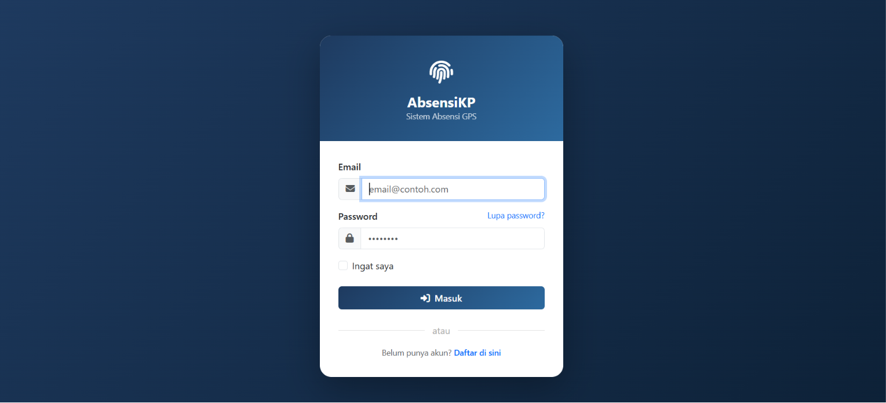 | 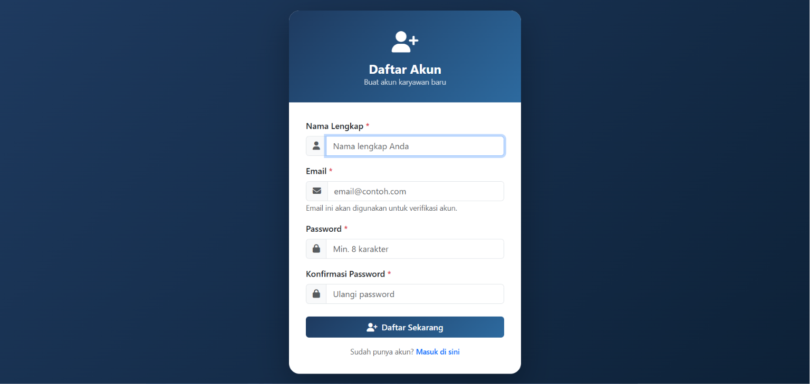 |

### 2. Verifikasi Email
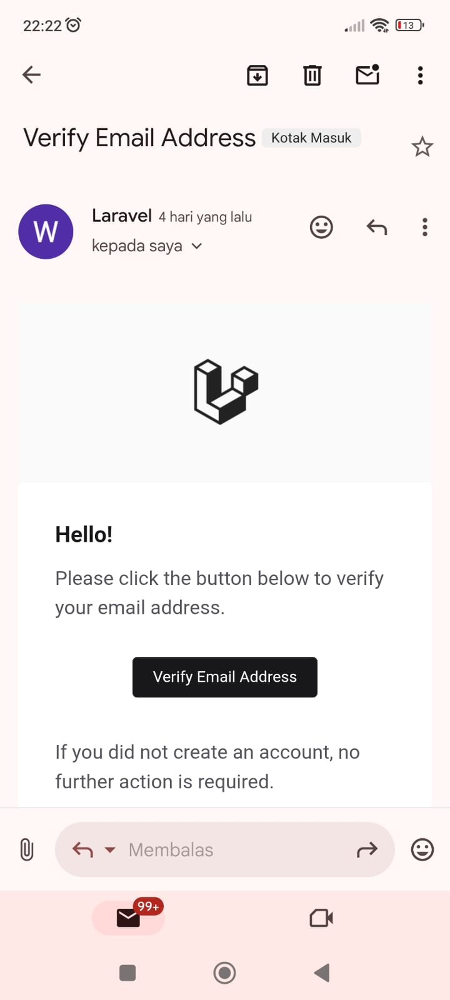
> Email verifikasi dikirim via Gmail SMTP ke inbox pengguna

### 3. Dashboard Admin
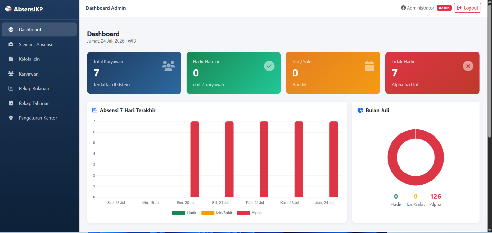
> Bar chart 7 hari, doughnut chart bulanan, tabel absensi & karyawan alpha

### 4. Dashboard Karyawan
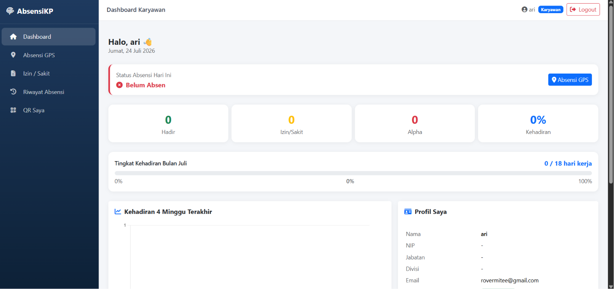
> Progress kehadiran, line chart, status absensi hari ini

### 5. Absensi GPS
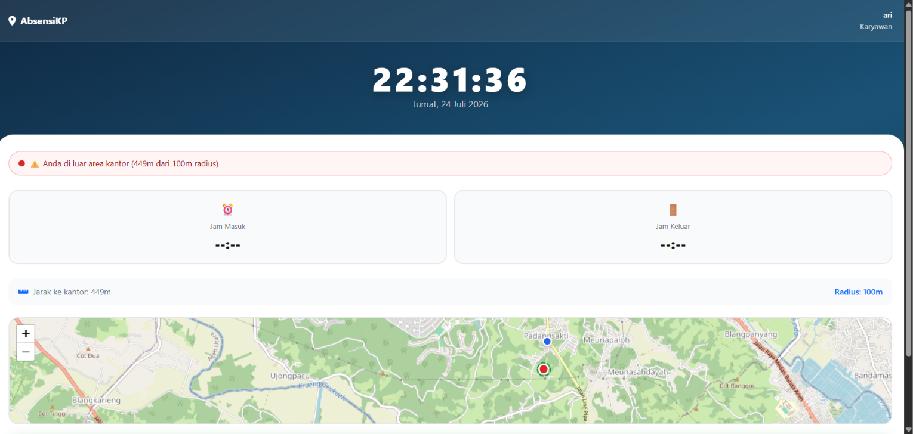
> Peta interaktif, deteksi radius, tombol absen masuk/keluar

### 6. CRUD Karyawan (Admin)
| Daftar Karyawan | Tambah Karyawan |
|-----------------|-----------------|
| 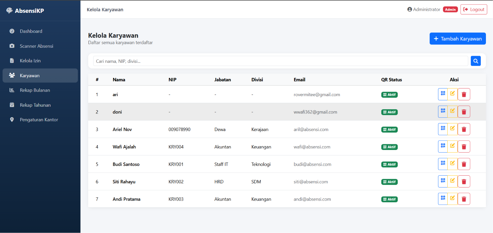 | 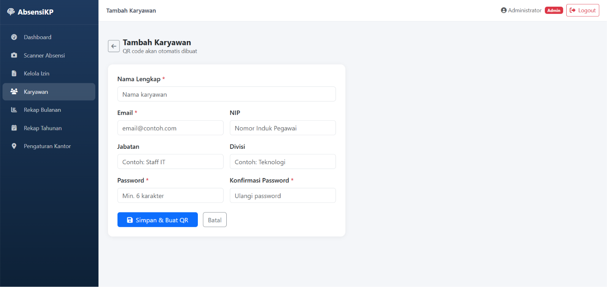 |

| Edit Karyawan | Hapus Karyawan |
|---------------|----------------|
| 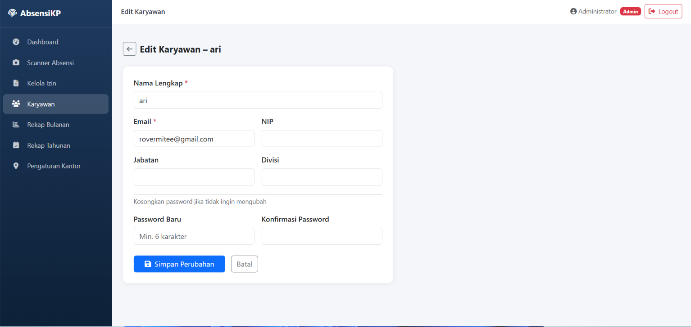 | 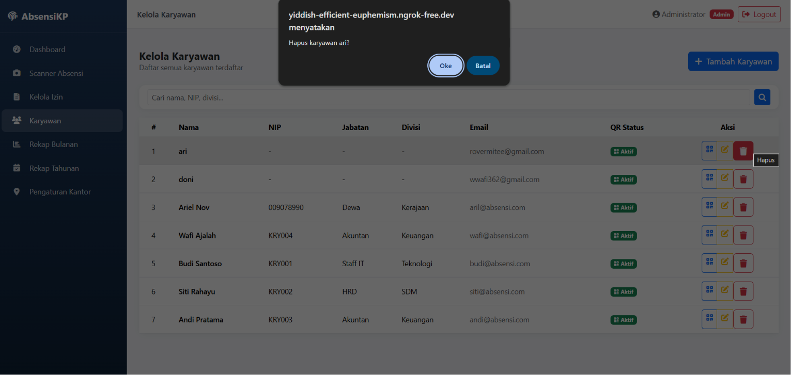 |

### 7. QR Code Karyawan
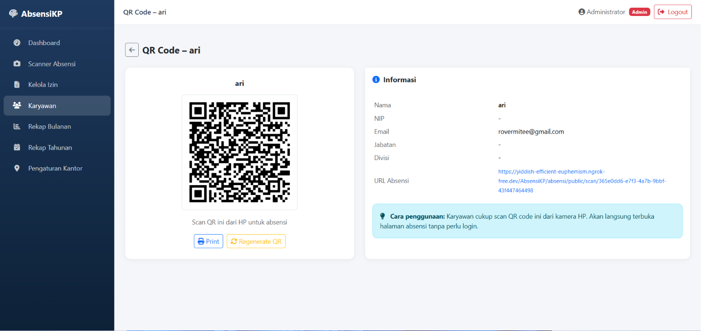

### 8. Rekap Absensi Bulanan
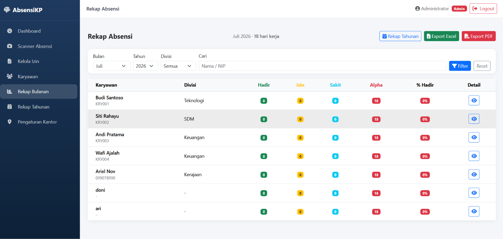

### 9. Rekap Tahunan
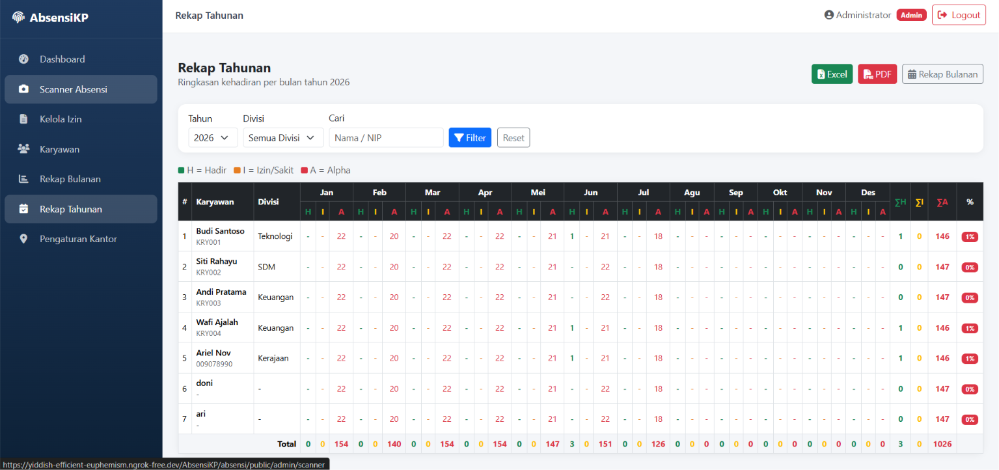

### 10. Pengajuan Izin
| Form Izin (Karyawan) | Kelola Izin (Admin) |
|----------------------|---------------------|
| 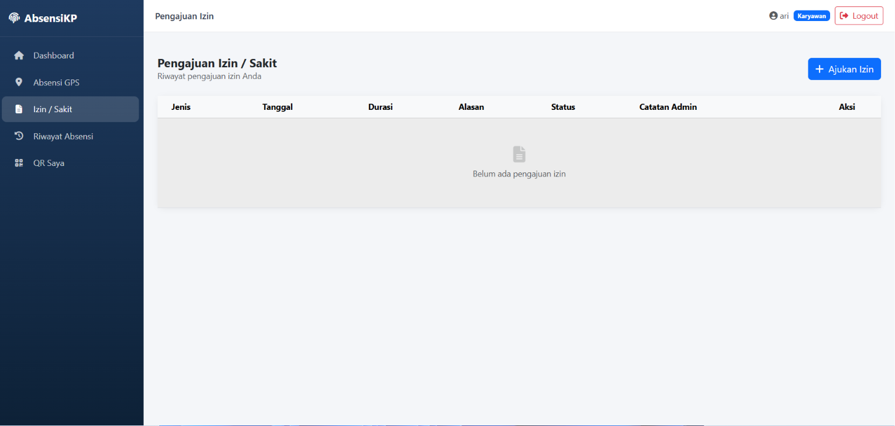 | 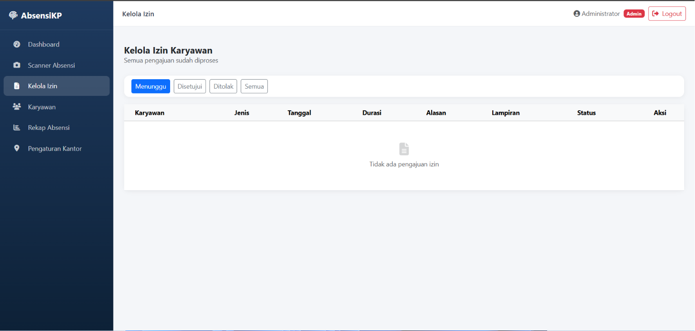 |

### 11. Export Excel
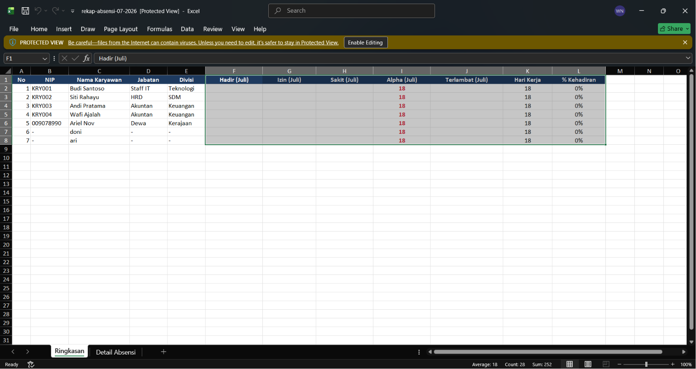
> 2 Sheet: Ringkasan (dengan warna) + Detail absensi harian

### 12. Export PDF
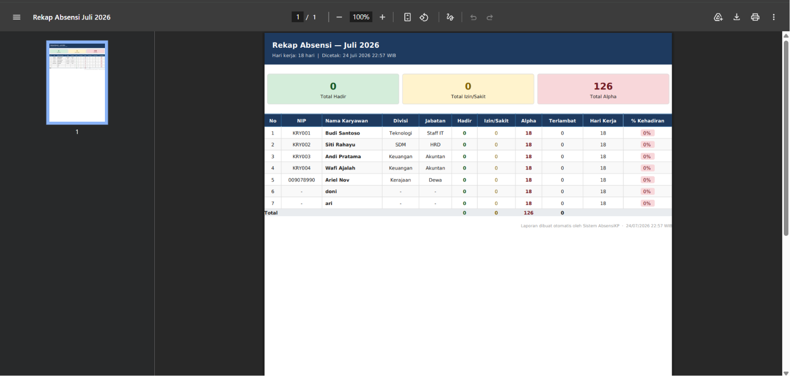
> Landscape A4 dengan statistik ringkasan dan tabel lengkap

### 13. REST API — Pengujian Postman

**Login API**
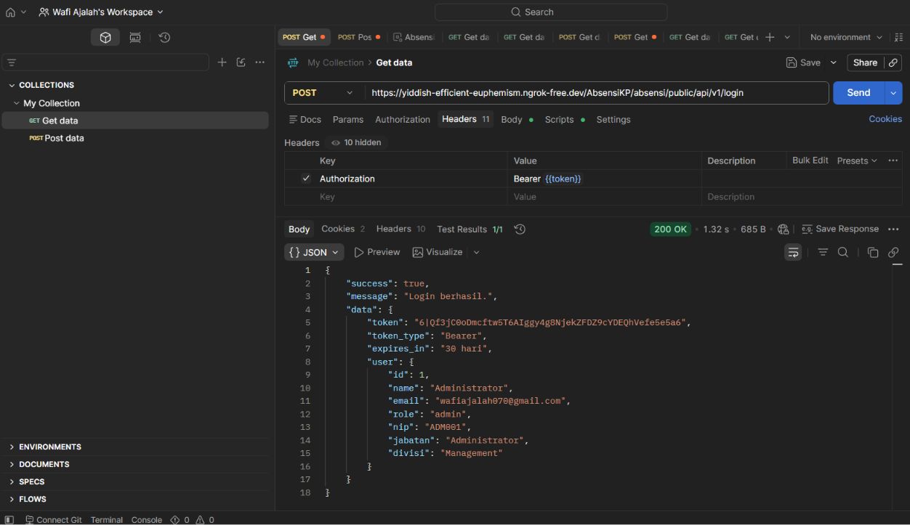

### 14. Pemisahan Hak Akses Admin vs Karyawan
| Sidebar Admin | Sidebar Karyawan |
|---------------|-----------------|
| 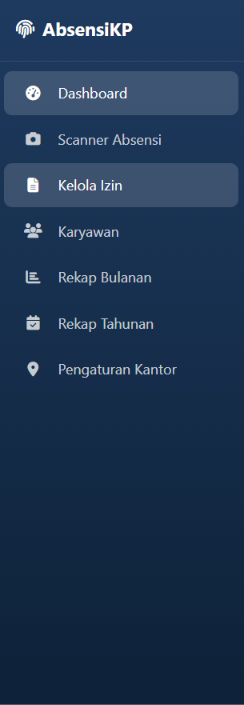 | 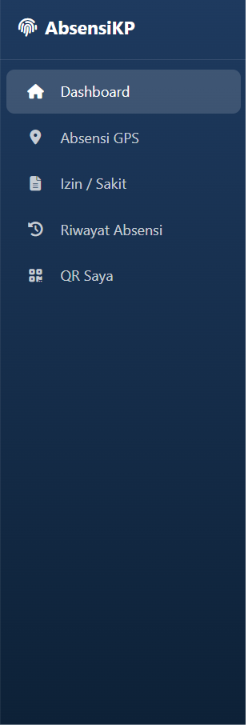 |

> Admin: Dashboard, Scanner, Kelola Izin, Karyawan, Rekap Bulanan, Rekap Tahunan, Pengaturan Kantor  
> Karyawan: Dashboard, Absensi GPS, Izin/Sakit, Riwayat, QR Saya

### 15. Tampilan Responsive
| Desktop | Mobile |
|---------|--------|
| 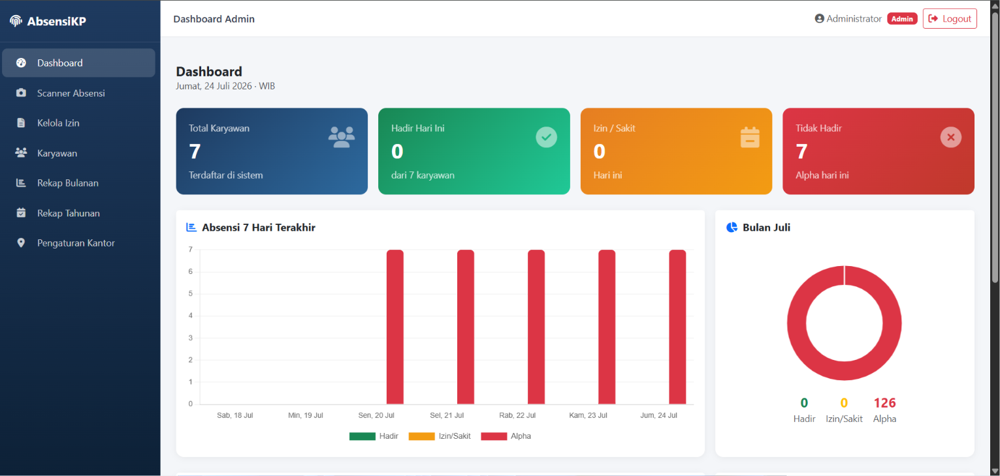 | 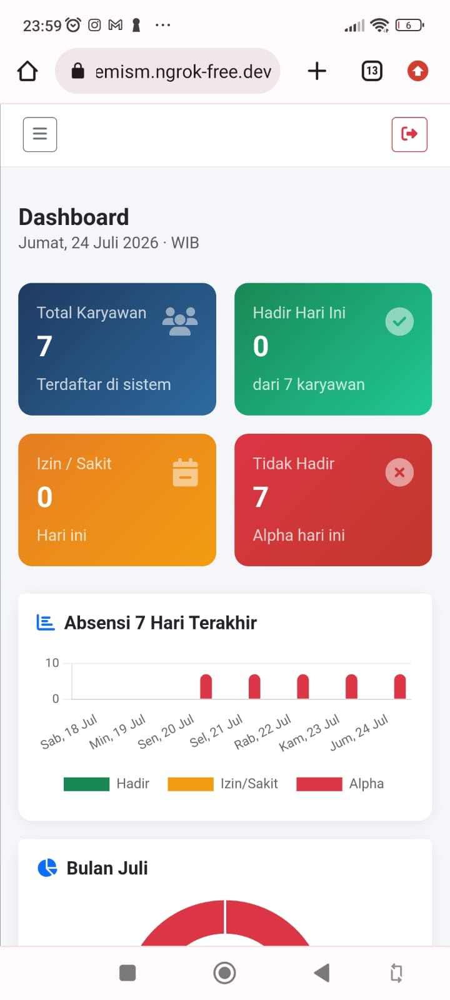 |

> Mobile: sidebar tersembunyi, buka via tombol ☰, overlay saat sidebar terbuka

---

## 🗂️ Struktur Direktori

```
absensi/
├── app/Http/Controllers/
│   ├── Api/            ← REST API (Auth, Absensi, Karyawan, Izin)
│   ├── Admin/          ← Dashboard, Karyawan, Rekap, Izin, Export, Scanner
│   ├── Auth/           ← Laravel Breeze (Login, Register, Verify, Reset)
│   └── Karyawan/       ← Dashboard, AbsensiGPS, Izin
├── app/Models/         ← User, Absensi, Izin, PengaturanKantor
├── app/Exports/        ← AbsensiExport, AbsensiTahunanExport, Sheet classes
├── database/migrations ← 13 migration files
├── resources/views/
│   ├── admin/          ← dashboard, karyawan, rekap, izin, scanner, pengaturan
│   ├── karyawan/       ← dashboard, absensi-gps, izin, riwayat, qr-saya
│   ├── auth/           ← login, register, verify-email, forgot/reset password
│   └── layouts/        ← app.blade.php, admin-sidebar, karyawan-sidebar
└── routes/
    ├── web.php         ← Web routes
    ├── api.php         ← REST API routes (16 endpoints)
    └── auth.php        ← Breeze auth routes
```

---

## 📝 Catatan

- Timezone: **Asia/Jakarta (WIB)**
- Jam kerja: **09:00 – 17:00 WIB** | Batas terlambat: **10:00 WIB**
- Alpha = hari kerja (Senin–Jumat) yang tidak ada record absensi
- Scheduler auto-mark alpha berjalan tiap **10:05 WIB** (butuh `php artisan schedule:work`)

---

*Dibuat dengan ❤️ menggunakan Laravel 12 & Bootstrap 5*
